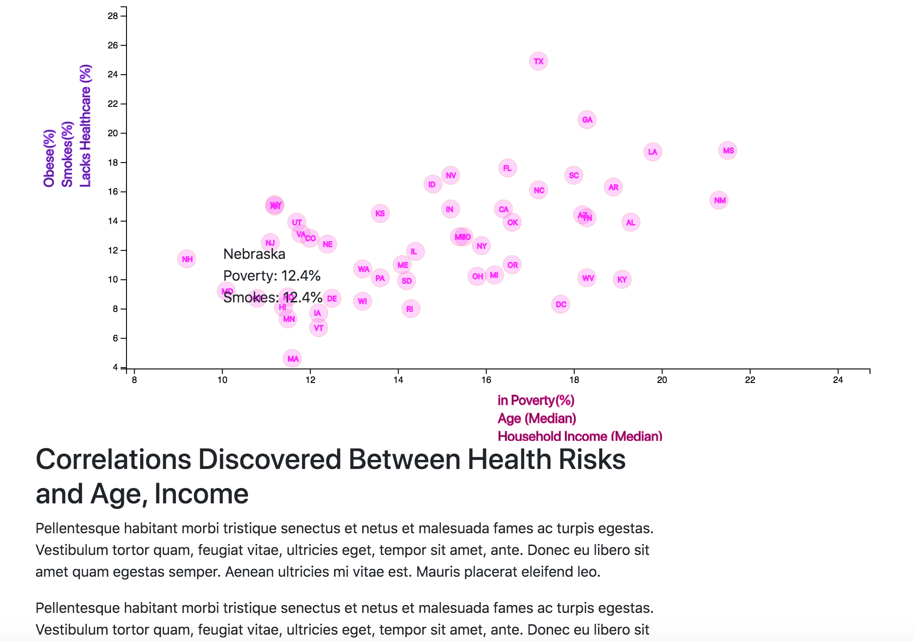

# Data Journalism and D3

 
We were tasked with analyzing the current trends shaping people's lives, as well as creating charts, graphs, and interactive elements to help readers understand our findings.

The editor wants to run a series of feature stories about the health risks facing particular demographics. She's counting on you to sniff out the first story idea by sifting through information from the U.S. Census Bureau and the Behavioral Risk Factor Surveillance System.

Data set: [https://factfinder.census.gov/faces/nav/jsf/pages/searchresults.xhtml](https://factfinder.census.gov/faces/nav/jsf/pages/searchresults.xhtml). The current data set incldes data on rates of income, obesity, poverty, etc. by state. MOE stands for "margin of error."

## Our Task

Using the D3 techniques, we created a scatter plot that represents each state with circle elements. We coded this graphic in the `app.js`  (using `data.csv` sorce) by using the `d3.csv` function. 

We placed labels in our scatter plot and gave them click events so that users can decide which data to display. We animated the transitions for our circles' locations as well as the range of our axes. We did this for three risk factors (Obese, Smokes and Lacks Healthcare) for each axis. And we made a choice of x parameter (In Poverty, Age(Median) and Household Income (Median)). Finaly we have 6 plots with incorporated d3-tips (we had recomendation to use `d3-tip.js` plugin developed by [Justin Palmer](https://github.com/Caged))

We used `python -m http.server` to run the visualization. This will host the page at `localhost:8000` in our web browser.